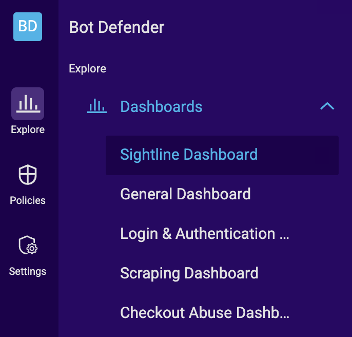

## About this article

A conceptual article explaining how to find and interpret relevant data in the user's Sightline Dashboard. This Dashboard showed bot activity on a user's application and was meant to help them monitor this activity over time. 

This article was challenging because the typical user for this feature was not a cybersecurity expert and did not always have a statistical background. Instead, they tended to be non-technical users that had to not only try to interpret the data presented in this dashboard, but to then share it with stakeholders who are interested in maintaining security standards in the company's application. These stakeholders also tended to lack techncial or cybersecurity backgrounds. 

This article is available publicly, so nothing has been redacted in the sample. You can view the current version [on their site.](https://docs.humansecurity.com/applications-and-accounts/docs/understanding-sightline-dashboard-activity)

## Understanding Sightline Dashboard activity

If you ever wonder about what went on behind an attack or need to report on how you know a spike in activity was from bots, then you can use the **HUMAN Sightline Dashboard** as a [secondary detection](/docs/terms/secondary-detection.md) tool. This dashboard features **Attack Profiles,** or the unique entities that are behind your bot traffic, to help you learn about bot behavior on your application. Then, you can summarize that information to continue to monitor those Attack Profiles or share what you’ve learned with your team.

You can learn more about understanding attacks with the Sightline Dashboard in this article. See our articles on the [Sightline Dashboard](https://docs.humansecurity.com/applications-and-accounts/docs/sightline-dashboard) or [Attack Profiles](https://docs.humansecurity.com/applications-and-accounts/docs/about-attack-profiles) to learn more about what you can achieve with HUMAN Sightline.

### Explore the Dashboard

You can visit the HUMAN Sightline Dashboard after Bot Defender blocks traffic to isolate specific Attack Profiles and learn more about unusual behavior on your application.

#### 1. Open the dashboard

To get started, navigate to **Bot Defender > Dashboards > Sightline Dashboard.**

#### 2. Apply filters

The Sightline Dashboard **filters** apply to the entire page and affect the data that appears. These filters are useful for narrowing your search down to specific applications, devices, threat types, and more. For example, if you know that you want to learn more about a recent attack, you might choose to filter results by the **Last day**. On the other hand, if you want to explore traffic from a specific time period, you can pick custom dates to filter by. You could also filter by specific threat types if, for example, you’re only interested in certain types of threats out of all your traffic.

:::info[Note]
The Dashboard always shows the largest Attack Profiles, which means that attack types with the largest distributions are the most prevalent. For example, scraping attacks tend to be higher volume than account takeover attacks. If you have both of them included in your filters, then you’ll likely see far more scraping activity than account takeover, even though the latter may be more interesting.
:::

You can learn more about available filters in our [Sightline Dashboard](https://docs.humansecurity.com/applications-and-accounts/docs/sightline-dashboard) article.

#### 3. Look for interesting activity

Once you apply your filters, the next step is looking out for interesting activity in your data. A good place to start is the Attack Profiles Over Time graph, which shows the distribution of blocked traffic over time. While looking over this graph, you might spot unusual patterns such as:

A sudden spike in activity over a short period of time
A new Attack Profile appearing that wasn’t there before
Any other activity that you’re curious about
For example, the graph below shows a spike in activity from a new group of bots, or a single Attack Profile. An Attack Profile is an individual entity that HUMAN Sightline believes is associated with certain bot traffic that has similar characteristics. It might be worth looking into this Attack Profile to learn what happened and what it was doing. Attack Profiles are color-coded, and the top five Profiles have their own colors. Any remaining ones are grouped together.

That said, if you don’t spot anything specific, feel free to look at any activity that you like. The Sightline Dashboard is meant to help you learn more about any and all bot traffic that happens on your application.

4. Open an Attack Profile
Once you find one that interests you, you can click the Attack Profile to learn more about it. Hover over and click a Profile to open its Attack Profile Behaviors and start learning about the Profile.

Understanding an Attack Profile
Understanding an Attack Profile means learning more about the behavior of a series of attacks made over time. The Attack Profile Behaviors area is the best way to learn more about an Attack Profile. Each section in this area has different data that you can use and share with the rest of your team. You can learn more about the information in each section in our Sightline Dashboard article.

In particular, the Profile Distribution Insights section visualizes the bot activity associated with each Profile compared to legitimate activity. Each insight tells you about the Attack Profile’s behavior, while the distribution demonstrates why this particular traffic was considered bot behavior. It’s the best place to learn more about an Attack Profile, including:

Why was this traffic identified as bots in the first place?
What were the bots doing?
You can learn how you can answer these questions with the examples below.

👍
Tip

While these aren’t the only types of questions you can answer with Attack Profile Behaviors, these are great places to start if you’re not sure what you’re looking for.

How was this Profile different from humans?
The important thing to remember about bots is that the more sophisticated they are, the more human they appear. Each individual bot may appear to be very close to a human initially. To highlight the differences, Profile Distribution Insights measures and shares six different insights over a distribution of bot traffic associated with the Profile. This means that, when the secondary detection decided to create this Profile, it flagged multiple instances of traffic with similar characteristics that lead it to believe it was a bot on at least one of these insights.

Having all these insights at your disposal means you can learn why certain traffic was flagged as bot behavior on one insight even if it seemed like legitimate traffic in other insights. For example, consider this Attack Profile’s Devices & Browsers insight. At first glance, this Attack Profile’s bot behavior looks very similar to legitimate behavior. Just based on this one insight, we might mistake the traffic from this Attack Profile as human if the system didn't have access to any other signals.

However, just one insight isn't enough. To get a full understanding of the Profile, we should consider all the insights HUMAN Sightline exposes. So, let’s consider a second insight, Target Routes:

Here, we see that the traffic associated with this Attack Profile was almost exclusively on the /login/facebook route. Meanwhile, other routes that have regular legitimate traffic, such as /login/magic-link and /login/phone, were almost completely ignored by traffic from this Profile. This exclusive focus on a single route is unusual for humans typically browsing a website, so it strongly indicates that this traffic was generated by bots.

This is just one example of how you can use insights to understand why traffic was considered bots. Other unusual behavior might be that the traffic is trying to act like legitimate traffic, but it’s suspiciously consistent. For example, if the Attack Profile’s traffic has the same number of requests coming out of multiple different Regions while your legitimate traffic is more varied, then this can also be an indication that the Profile’s traffic was from bots.

Make sure to consider all insights together rather than focusing on one or two that look similar to humans.

👍
Takeaway

Bots try to look as legitimate as possible to avoid detection, but there is always at least one indicator that they aren’t. Look for trends that are inconsistent with legitimate traffic over all the available insights to get a full understanding of why traffic was flagged as bot behavior.

What were the bots doing?
After you confirm that a Profile’s traffic is indeed from bots, you probably want to know what the bots were doing on your application. By combining what you know about the Attack Profile and the data shown in Profile Distribution Insights, you can deduce an Attack Profile’s behavior.

For example, consider the Attack Profile below. From its Profile ID, we know that these bots are from scraping attacks. At the same time, we can observe that the majority of the bot traffic was focused on the /products/:id/gallery route. From this, we can deduce that the bots were likely attempting to scrape product information from individual users’ galleries across the application.

📘
Note

HUMAN Sightline groups together similar paths into one route and replaces unique values with generic variables. For example, the :id in /products/:id/gallery indicates the bots focused on similar paths with user-specific values in place of the :id.

You can use any Distribution Insight in a similar way to learn about the Attack Profile from different perspectives, like what IPs they used, what Regions they originated from, or which Referrers they came from.

👍
Takeaway

Use a combination of filters, Attack Profile information, and Distribution Insights to determine the Attack Profile’s behavior. If you don’t see top results for illegitimate traffic, try sorting by Top Profile Traffic .